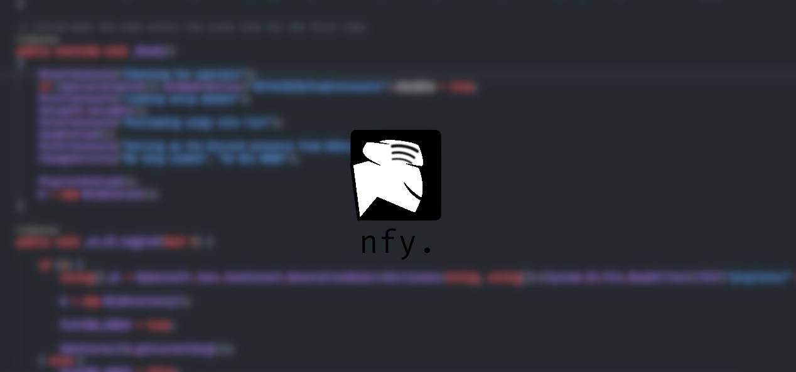

# NJMono

> *NJMono - standardizing NFy*

NFy Mono (*njmono.exe*) is the swiss-army knife for NFy features, providing a great (and **free**) music experience.

Features:

- Plugins
- Support for almost every audio format
- Playlists
- Version Management
- Launcher (other project)
- Auto Setup
- Volume Slider
- Easy-to-use API
- Faster than NFy; with a higher binary size.
- Playlist Looping

## Differences

| Features           | NFy          | NFy Mono             | NFy.js            | LibNFy   | NFyCli      | NFy.DJS                              |
|--------------------|--------------|----------------------|-------------------|----------|-------------|--------------------------------------|
| OGG                | Yes          | Yes                  | Yes               | No       | Yes         | Yes                                  |
| WAV                | No           | Yes                  | Yes               | No       | Yes         | Yes                                  |
| MP3                | No           | Yes                  | Yes               | No       | Yes         | Yes                                  |
| Playlists          | Yes          | Yes (since Mono 3)   | No (program-wide) | No       | No          | No                                   |
| Standardization    | 85%          | 100%                 | 96%               | 5%       | 40%         | 6%                                   |
| Framework/Library  | Godot Engine | BumbleBee Engine X JS| Electron.js       | C++      | Rust        | Electron/D (D Language X JavaScript) |
| Version Management | No           | Yes (Since Mono 7)   | No                | No       | No          | No                                   |
| Song Looping       | Yes          | Yes                  | Yes               | No       | No          | No                                   |
| Playlist Looping   | Yes (Buggy)  | Yes                  | No                | No       | No          | No                                   |
| Automatic Setup    | No           | Yes (Since Mono 7)   | Yes               | No       | No          | No                                   |
| Themes             | Yes          | Yes                  | No                | No       | No (No GUI) | No                                   |
| Song Method        | List         | List                 | Stack             | Singular | Singular    | Stack                                |
| Software           | Yes          | Yes (NFy's Software) | No                | No       | No          | No                                   |

## Building

### Using Bumble/Godot Compat

To build using Godot, you need -

* Visual Studio 2019/2022
* Godot 3.4 MONO (Only Mono versions are supported)
* .NET Core

Open Godot, and import the project.

After loading the project, go to Project > **Export...** and export your platform.